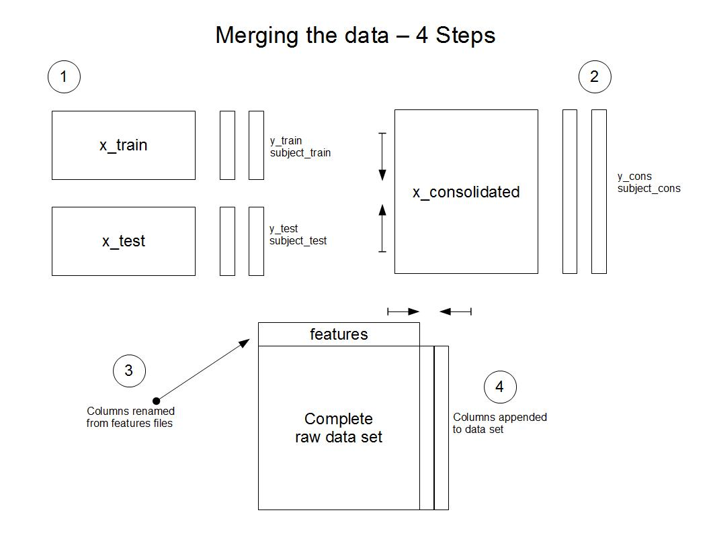

Cleaning Data Readme File
========================================================

<!-- This is an R Markdown document. Markdown is a simple formatting syntax for authoring web pages (click the **Help** toolbar button for more details on using R Markdown).

When you click the **Knit HTML** button a web page will be generated that includes both content as well as the output of any embedded R code chunks within the document. You can embed an R code chunk like this: -->

This file will describe how I processed the data for this assignment.  Please note that there is jpeg image on in the Github repository that pictorially shows how this assimgment was completed.

The program completes the following steps:

-It initiallizes the working directory to the location of the data files on my PC

-It then loads the three test data files (subject_test, x_test, y_test) into memory

-It then loads the three training data files (subject_train, x_train, y_train) into memory

-Once the training and test data is loaded, the sets are combined into consolidated sets by rbinding the test and train set together.  The new data set are call subjects, data and activity.  The gyro and accelerometer measurement data is called simply "data", the acitivity code data is called "acitivty" and subject data is call "subjects".

-Before the acitivity and subject data is bound to the data table, the features file is read and used to rename the columns in the data file.

-Once the column names are in place, the subject column is appended to the data set.  Once that is complete, the acitivity codes are translated into descriptive names and appended as well.

-At this point, the data is complete and new any unwanted columns need to be filtered out.  I accomplished this by creating a new data set and copying the subjects and activity columns first, and I looped through the remaining columns in the data set to find columns with 'mean()' and 'std()' in the name and appended those as well.

-I then sorted the data to facilitate validating my outcomes and summarized it by acitivity and subject as required.  The summary values are averages of the gyro and accelerometer data

-The output is then written as a file called output.csv.  I then recreated the assignment in Excel to test that summary data was correct and that my program produces the correct outputs.

